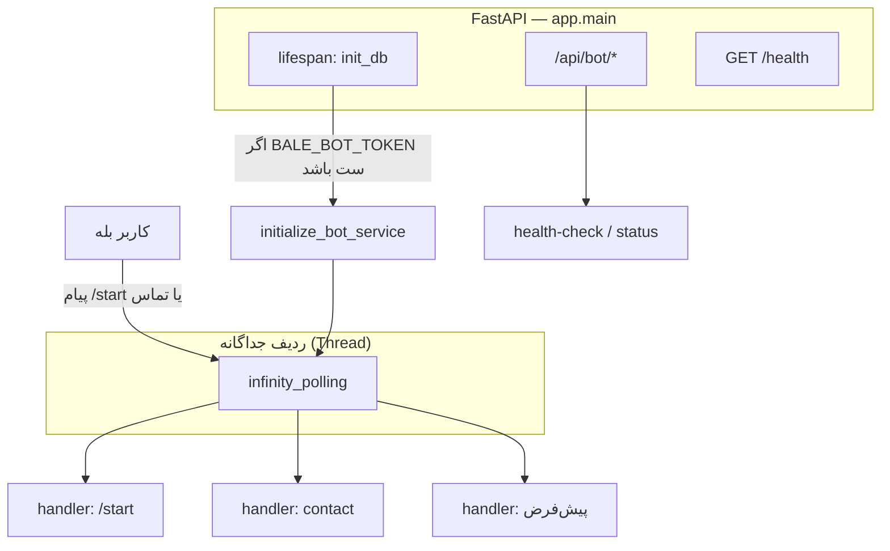
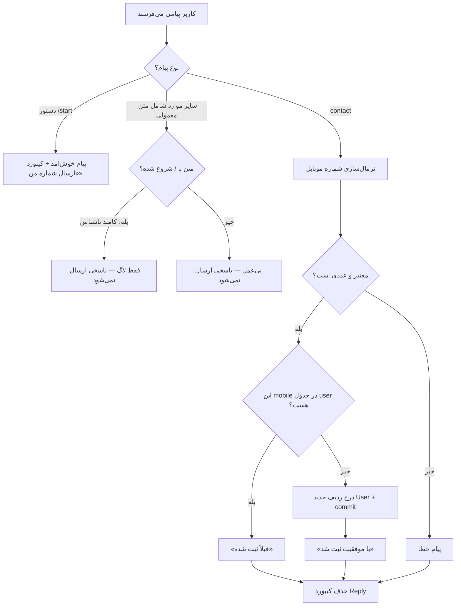
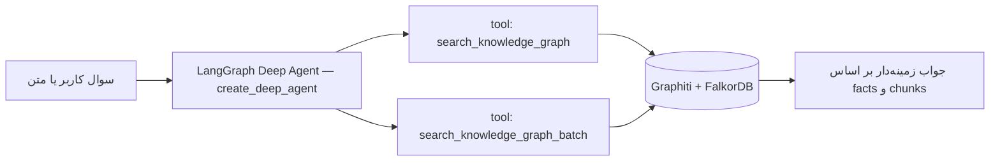
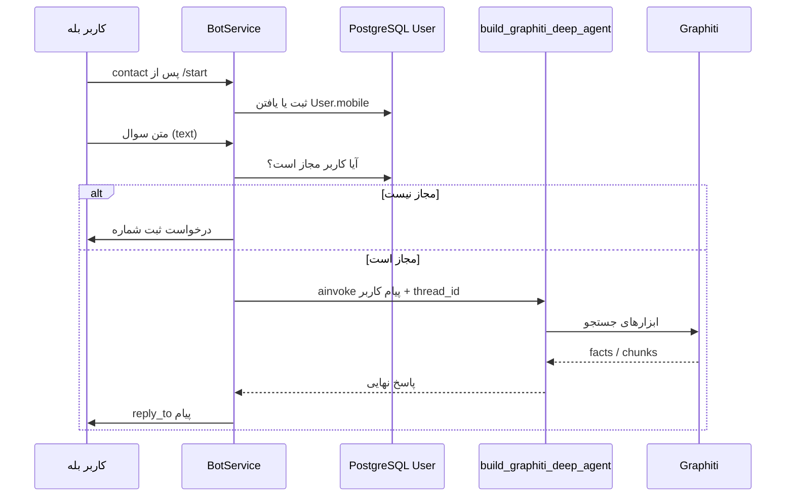

# ربات بله، احراز هویت و ادغام عامل Deep (Graphiti)

این سند **جریان واقعی کد فعلی** بک‌اند را توضیح می‌دهد و مراحل پیشنهادی برای **پاسخ‌گویی هوش مصنوعی** مشابه `deep_agent.py` **بعد از تأیید هویت کاربر** را مشخص می‌کند.

---

## ۱. نمای کلی: اپلیکیشن و ربات



**خلاصهٔ متنی**

- **`app.main`**: با بالا آمدن اپ، دیتابیس مقداردهی می‌شود؛ اگر `BALE_BOT_TOKEN` تنظیم شده باشد، `initialize_bot_service()` صدا زده می‌شود و **Polling بله در یک Thread جدا** اجرا می‌شود تا مسیرهای HTTP بلاک نشوند.
- **`/api/bot`**: فعلاً مسیرهای سبک مانند `/health-check` و `/status` است؛ خود گفت‌وگوی بله از طریق **هندلرهای PyTelegramBotAPI** داخل `integrations/bale/bot_service.py` است، نه به‌صورت خودکار از طریق REST برای هر پیام متنی.

---

## ۲. فلوچارت رفتار ربات بله (همان چیزی که امروز در کد هست)



### نسخهٔ ASCII (بدون نیاز به رندر Mermaid)

```
کاربر                     BotService (telebot)
  |                              |
  |-------- /start -------------->|  reply: خوش‌آمد + دکمه تماس
  |-------- contact ------------->|  DB: جستجوی User.mobile؛ insert یا پیام تکراری
  |-------- متن معمولی --------->|  (فعلاً) بدون پاسخ
```

**نکته مهم:** الان «احراز هویت» در عمل یعنی **اشتراک‌گذاری شماره تماس از طریق دکمه** و ثبت **`User.mobile`** در جدول `user`. فیلدی برای **`bale_user_id`** یا اتصال مستقیم «شناسه بله → کاربر دیتابیس» در همین مسیر پیاده نشده؛ برای سناریوی «فقط کاربران ثبت‌شده بتوانند از AI استفاده کنند» معمولاً باید **یا** شناسه بله را در DB نگه دارید **یا** منطقی داشته باشید که بتوان از روی تماس قبلی تشخیص داد همین شخص همان موبایل را ثبت کرده است (نیاز به طراحی دارد؛ بخش ۴).

---

## ۳. عامل هوش مصنوعی (`deep_agent`) کجاست و چه می‌کند؟



- **مسیر کد**: `src/app/agent/deep_agent.py` → `build_graphiti_deep_agent()`.
- **ابزارها**: در `graphiti_tool.py` به گراف دانش متصل می‌شوند و از `search_concepts` / `search_concepts_batch` استفاده می‌کنند.
- **پیکربندی LLM**: از متغیرهای محیطی مانند `AGENT_CHAT_MODEL`، `AGENT_CHAT_API_KEY`، `AGENT_CHAT_BASE_URL` (یا fallbackهای داخل همان ماژول) استفاده می‌شود؛ در صورت کمبود مقادیر، ساخت عامل خطا می‌دهد.
- **حافظه و جلسه** (اختیاری): در دمو ترمینال `scripts/graphiti_agent_demo.py` از `MemorySaver()` و `thread_id` استفاده می‌شود؛ برای حافظهٔ بلندمدت روی دیسک می‌توان `USER_MEMORIES_DIR` و `user_id` را مطابق مستند همین ماژول استفاده کرد.

**فعلاً این عامل به ربات بله وصل نیست**؛ فقط به‌صورت اسکریپت/مثال قابل اجراست.

---

## ۴. اگر بخواهم بعد از احراز هویت، پاسخ AI مثل `deep_agent` بدهم، چه کار کنم؟

### گام‌های پیشنهادی (به‌ترتیب)

1. **تعریف دقیق «کاربر احرازشده»**  
   - حداقل فعلی: بعد از `handle_contact` ردیفی در `user` با همان `mobile` وجود دارد.  
   - برای پرسش‌های بعدی بدون ارسال دوباره تماس، بهتر است **`telegram/bale user id`** (مثلاً `message.from_user.id`) را در دیتابیس ذخیره یا به `User` لینک کنید تا بتوانید در هر پیام متنی بپرسید «این چت‌آی‌دی ثبت شده است؟».

2. **هندلر پیام متنی جدید** در `bot_service.py`  
   - **قبل** از هندلر کلی `func=lambda m: True`، یک `message_handler` با فیلتر مناسب (مثلاً `content_types=['text']` و تابعی که `/` نباشد) اضافه کنید.  
   - داخل هندلر: اگر کاربر «ثبت‌شده» نیست → پیام راهنما («ابتدا شماره را بفرستید»).  
   - اگر ثبت‌شده است → متن را به لایهٔ عامل بدهید.

3. **فراخوانی ناهمزمان عامل**  
   - `build_graphiti_deep_agent()` و `agent.ainvoke(...)` **async** هستند؛ هندلرهای `telebot` در این پروژه **هم‌روند (sync)** اند.  
   - الگوهای رایج:  
     - `asyncio.run(agent.ainvoke(...))` در هندلر (ساده ولی در Thread پولینگ قابل‌قبول)، یا  
     - قرار دادن کار در `asyncio.get_event_loop().create_task` اگر حلقهٔ رویداد از قبل در همان thread دارید، یا  
     - صف / worker جدا برای جلوگیری از مسدود شدن polling در بار سنگین.  
   برای شروع MVP معمولا `asyncio.run` روی یک فراخوان کوتاه کافی است؛ بعداً مقیاس را جدا کنید.

4. **شناسهٔ جلسه (`thread_id`)**  
   - برای هر کاربر بله یک `thread_id` پایدار (مثلاً `"bale-{from_user.id}"`) به `RunnableConfig["configurable"]` بدهید تا خلاصه‌سازی/چیدمان مکالمه درست کار کند (مثل `graphiti_agent_demo.py`).

5. **دامنهٔ گراف (`group_ids`)**  
   - اگر باید جستجو فقط برای گروه/درس خاص باشد، می‌توانید در متن ورودی یا در سیستم‌پرامپت/ابزار، `group_ids` را مطابق `graphiti_tool` پاس بدهید.

6. **پیش‌نیاز زیرساخت**  
   - FalkorDB/Graphiti و متغیرهای LLM باید در محیط اجرای همان پروسه‌ای که ربات را poll می‌کند در دسترس باشند (همانند اجرای `scripts/graphiti_agent_demo.py`).

### نمودار هدف (پس از پیاده‌سازی)



---

## ۵. فایل‌های کلیدی برای مراجعه

| موضوع | مسیر |
|--------|------|
| راه‌اندازی اپ و پولینگ | `src/app/main.py` |
| هندلرهای بله | `src/integrations/bale/bot_service.py` |
| API زیرمجموعهٔ `/api/bot` | `src/app/api/bot/router.py`, `routes/health.py` |
| مدل کاربر | `src/app/models/user.py` |
| ساخت عامل | `src/app/agent/deep_agent.py` |
| ابزار گراف | `src/app/agent/graphiti_tool.py` |
| جستجوی گراف | `src/app/knowledge_graph/search.py` |
| دمؤ ترمینال | `scripts/graphiti_agent_demo.py` |

---

## ۶. اختلاف با `docs/DASTAN_DARI.md`

سند عمومی‌تر [`DASTAN_DARI.md`](./DASTAN_DARI.md) ممکن است بخشی از نام مسیرها یا جداول (مثل `bot_users`) را منعکس کند که با **نسخهٔ فعلی** این مخزن در `bot_service.py` و مدل `User` هم‌خوان نباشد. برای رفتار ربات و ثبت‌شماره، **این سند و کد مرجع** ملاک است.

---

*به‌روزرسانی با توجه به ساختار مخزن: اردیبهشت ۱۴۰۵*
