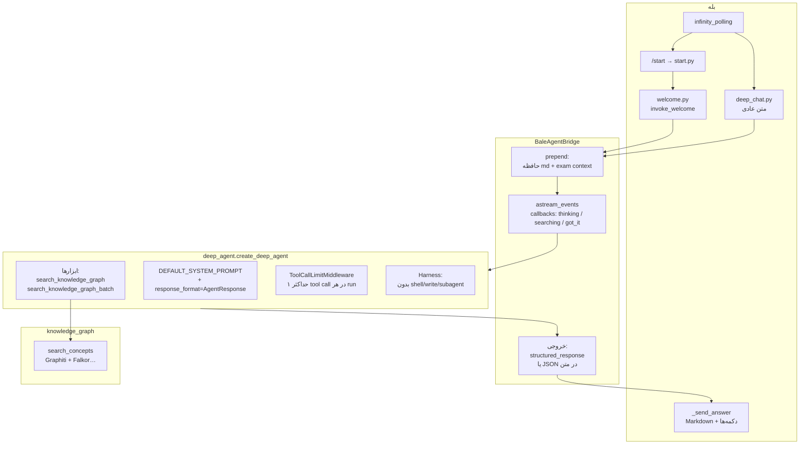

# جریان Deep Agent، بله، ابزار گراف و فرمت پاسخ

این سند تصویر معماری مسیر **کاربر بله → BaleAgentBridge → LangGraph Deep Agent (deepagents) → Graphiti** را با تمرکز بر **ابزارها**، **`AgentResponse`** و رفتار handlerها خلاصه می‌کند. بخش‌های **۵.۱ تا ۵.۵** جزئیات قرارداد ابزارها، پارس خروجی در bridge، انواع پاسخ، و ساخت سوال‌ها و callbackها را عمیق‌تر شرح می‌دهند.

---

## ۱. نقش هر لایه

### بله (`integrations/bale/bot_service.py`)

- یک `TeleBot` می‌سازد، آدرس API بله را ست می‌کند و برای درخواست‌های POST با بدنهٔ طولانی، پارامترها را در **بدنه** می‌فرستد (کاهش خطای ۴۱۴ URI Too Large).
- یک نمونهٔ **`BaleAgentBridge`** می‌سازد و از طریق **`BaleHandlerDeps`** به تمام handlerها تزریق می‌کند (`register_handlers`).

### دستور `/start` (`integrations/bale/handlers/start.py`)

- اگر کاربر در دیتابیس با هویت بله **لینک نشده** باشد: کیبورد «ارسال شماره من» و پیام ثبت‌نام.
- اگر **لینک شده** باشد: **`run_welcome_step`** در `welcome.py` فراخوانی می‌شود.

### خوش‌آمد (`integrations/bale/handlers/welcome.py`)

- در صورت وجود توکن، URL عکس پروفایل کاربر گرفته می‌شود.
- **`bridge.invoke_welcome(user_id, first_name, profile_url)`** اجرا می‌شود؛ با عکس، ورودی مدل به صورت **چندبخشی** (تصویر + متن پرامپت onboarding) است.
- اگر خروجی **`AgentResponse`** باشد:
  - **`save_user_memory`** فایل markdown حافظهٔ بلندمدت را می‌نویسد؛
  - **`next_questions`** در state مشترک با `deep_chat` ذخیره می‌شود؛
  - بدنه با **`_format_structured_response`** ساخته و با **`markdown_to_bale_markdown`** برای بله آماده می‌شود.
- اگر خروجی **رشتهٔ ساده** باشد: حافظه با `fun_fact` خالی ذخیره و پیام fallback ارسال می‌شود.

### چت عمیق (`integrations/bale/handlers/deep_chat.py`)

- فقط پیام **متنی** که با `/` شروع نشود.
- کاربر باید در DB لینک شده باشد؛ سپس **سقف مصرف پلن** با `subscription_service.check_rate_limit` بررسی می‌شود.
- **`bridge.invoke_reply_with_status`** با سه callback:
  - **`on_thinking`**: با اولین رویداد شروع chain/model → پیام وضعیت تصادفی؛
  - **`on_searching`**: با اولین **`on_tool_start`** → ویرایش همان پیام (جستجو در گراف)؛
  - **`on_got_it`**: با اولین **`on_tool_end`** → متن «پیدا شد / آمادهٔ ارسال».
- خروجی با **`_send_answer`**:
  - **`AgentResponse`**: بدنهٔ اصلی؛ برای **`exam`** سوالات چندگزینه‌ای با callback؛ برای سایر انواع **`next_questions`** با دکمه‌های inline؛
  - **`str`**: پاسخ خام؛ در صورت طولانی بودن با **`split_reply_text`** تکه‌تکه می‌شود.
- Callbackهای **`nq:`** (سوال پیشنهادی)، **`eq:`** (پاسخ آزمون)، **`ex:`** (توضیح بیشتر آزمون) دوباره bridge را صدا می‌زنند؛ برای آزمون، **`bridge.add_exam_context`** نتیجه را برای **پیام بعدی** در prefix تزریق می‌کند.

---

## ۲. پل (`app/services/agent_bridge.py`)

- **`BaleAgentBridge`** به‌صورت تنبل **`build_graphiti_deep_agent(checkpointer=MemorySaver())`** را می‌سازد.
- **`thread_id`** در `config`:
  - چت عادی: `user-{user_id}`؛
  - welcome: `user-welcome-{user_id}` (جدا از گفتگوی عادی).
- قبل از ارسال به گراف:
  - در صورت وجود، محتوای **`USER_MEMORIES_DIR/user_{user_id}.md`** به ابتدای پیام **prepend** می‌شود؛
  - ورودی‌های انباشتهٔ **`add_exam_context`** برای همان کاربر هم prepend و از صف خالی می‌شود.
- اجرا با **`astream_events` (v2)**؛ از رویدادها:
  - **`usage_metadata`** برای جمع توکن و **برآورد هزینه** (`INPUT_COST_PER_1M` / `OUTPUT_COST_PER_1M`)؛
  - در **`on_chain_end`**: اولویت با **`structured_response`** از نوع **`AgentResponse`**؛ در غیر این صورت متن آخرین پیام assistant؛ اگر متن شبیه JSON با **`response_type`** باشد، **`AgentResponse.model_validate`** انجام می‌شود.
- **`invoke_welcome`** از **`ONBOARDING_PROMPT_TEMPLATE`** و بلوک‌های personality در `app/agent/prompts.py` استفاده می‌کند و در صورت وجود عکس، محتوای کاربر را به صورت لیست بخش‌های تصویر+متن می‌فرستد.

**نکته:** در این bridge به **`build_graphiti_deep_agent`** آرگومان **`user_id` / FilesystemBackend** پاس داده نمی‌شود؛ حافظهٔ markdown کاربر در عمل با **خواندن فایل و prepend به پیام** تأمین می‌شود، نه با backend پیش‌فرض agent برای هر کاربر داخل همان factory.

---

## ۳. Deep Agent (`app/agent/deep_agent.py`)

- با کتابخانه **`deepagents`** و **`create_deep_agent`** ساخته می‌شود.
- **مدل چت** از متغیرهای محیطی: `AGENT_CHAT_MODEL`, `AGENT_CHAT_API_KEY`, `AGENT_CHAT_BASE_URL`, و در صورت نیاز دما و حد توکن؛ در نبود مقادیر ضروری خطا می‌دهد.
- **ابزارها** (فقط دانش گراف):
  - **`search_knowledge_graph`**؛
  - **`search_knowledge_graph_batch`**.
- **`ToolCallLimitMiddleware(run_limit=max_tool_calls_per_run)`** با پیش‌فرض **`max_tool_calls_per_run=1`**: در هر اجرای agent حداکثر **یک** فراخوانی ابزار (کنترل هزینه و حلقهٔ ابزار).
- **`response_format=AgentResponse`**: خروجی ساخت‌یافته با مدل Pydantic **`AgentResponse`** هم‌تراز است.
- **`_ensure_graphiti_harness_profiles`**: ابزارهای پرریسک پیش‌فرض (shell، نوشتن فایل، subagent، لیست فایل و غیره) از harness حذف یا غیرفعال می‌شوند تا سطح ابزار کم و ایمن بماند.

---

## ۴. ابزار گراف (`app/agent/graphiti_tool.py` + `app/knowledge_graph`)

- هر ابزار **`search_concepts`** یا **`search_concepts_batch`** را فراخوانی می‌کند.
- نتیجهٔ **`ConceptSearchResult`** (لبه‌ها = facts، اپیزودها = قطعات متن) به رشتهٔ خوانا برای مدل تبدیل می‌شود؛ طول هر episode با **`max_episode_chars`** محدود می‌شود.
- **`app/knowledge_graph/search.py`** با کلاینت **`Graphiti`** و preset **`rrf`** یا **`cross_encoder`** (طبق تنظیمات) جستجو می‌کند و تکراری‌ها را کم می‌کند.

---

## ۵. فرمت پاسخ (`app/agent/format_response.py` + `app/agent/prompts.py`)

- **`AgentResponse`** شامل:
  - **`response_type`**: `teaching` | `welcome` | `exam` | `simple`؛
  - فیلدهایی مانند `main_content`, `header`, `key_points`, `fun_fact`, `next_questions`, `exam_questions` (`ExamQuestion`).
- در **`DEFAULT_SYSTEM_PROMPT`** (در `prompts.py`): زبان فارسی، قوانین **Bale markdown** (`*` پررنگ، `_` ایتالیک، گلوله با `•`)، محدودهٔ **زیست یازدهم**، و اینکه **بر اساس درخواست کاربر کدام `response_type`** انتخاب شود.
- لایهٔ بله در **`deep_chat._format_main_response`** برای نمایش نهایی، بخشی از فیلدها را ترکیب می‌کند (مثلاً برای `teaching` نکات کلیدی و fun_fact؛ برای `welcome` تحلیل شخصیت از `fun_fact`).

---

## ۵.۱ ابزارها (Tools) — جزئیات فنی

### ۵.۱.۱ چه ابزارهایی واقعاً به مدل داده می‌شود؟

در `build_graphiti_deep_agent` فقط این دو ابزار به گراف اضافه می‌شوند:

| نام ابزار (در مدل) | تابع پایتون | نقش |
|---------------------|-------------|-----|
| `search_knowledge_graph` | `build_graphiti_search_tool` | یک **پرسش** یا رشتهٔ جستجو؛ یک بار `search_concepts` |
| `search_knowledge_graph_batch` | `build_graphiti_batch_search_tool` | **چند پرسش مستقل**؛ `search_concepts_batch` (موازی در لایهٔ knowledge graph) |

بقیهٔ ابزارهای معمول Deep Agents (shell، نوشتن فایل، subagent، …) از طریق **Harness** برای این پروژه حذف یا غیرفعال شده‌اند؛ فهرست **`excluded_tools`** در `deep_agent.py`:  
`execute`, `write_file`, `edit_file`, `task`, `ls`, `read_file`, `glob`, `grep`, `write_todos`.  
همچنین **`GeneralPurposeSubagentProfile(enabled=False)`** است؛ یعنی زیرعامل عمومی هم در دسترس نیست.

### ۵.۱.۲ قرارداد ورودی و خروجی هر ابزار

**تکی — `search_knowledge_graph(query, group_ids=None)`**

- **`query`**: متن آزاد فارسی/انگلیسی؛ همان چیزی که به Graphiti به‌صورت جستجوی مفهومی می‌رود.
- **`group_ids`**: اختیاری؛ رشته با **کاما** بین چند شناسهٔ گروه (برای فیلتر کردن داده در گراف). در docstring تأکید شده **زیرخط (`_`) برای IDها بهتر است** چون خط تیره می‌تواند فیلتر fulltext Falkor را خراب کند.
- **خروجی**: یک رشتهٔ چندخطی که برای مدل خواناست:
  - برای هر لبه (رابطهٔ گراف): `Fact i [نام_لبه]: متن_fact`
  - برای هر اپیزود (قطعهٔ سند): `Chunk i: متن` با برش به **`max_episode_chars`** (پیش‌فرض ۱۵۰۰ کاراکتر) و در صورت برش، `…` در انتها.
  - اگر چیزی نیاید: `"No matching facts or chunks were retrieved."`

**دسته‌ای — `search_knowledge_graph_batch(queries, group_ids=None)`**

- **`queries`**: لیست رشته؛ هر آیتم یک جستجوی جدا.
- **`group_ids`**: همان قرارداد تکی؛ برای همهٔ کوئری‌های آن یک فراخوانی اعمال می‌شود.
- **خروجی**: برای هر کوئری یک بخش به شکل `### Query: <برچسب>\n\n<body>`؛ بخش‌ها با `\n\n---\n\n` از هم جدا می‌شوند. برچسب‌ها از **`nonempty_batch_queries`** می‌آید (همان کوئری‌های غیرخالی به ترتیب).

### ۵.۱.۳ راهنمای سیستم برای «کی کدام ابزار؟»

در `prompts.py`، بلوک **`KNOWLEDGE_GRAPH_INSTRUCTIONS`** به مدل می‌گوید:

- اگر **یک** پرسش برای متریال درس است → `search_knowledge_graph`.
- اگر **چند پرسش مستقل** هم‌زمان برای متریال لازم است → `search_knowledge_graph_batch` (به‌جای تکرار فراخوانی تکی).

و تأکید می‌شود پاسخ را بر پایهٔ facts و chunkها **زمین‌چین** کند و اگر گراف چیز مفیدی نداد، صریح بگوید.

### ۵.۱.۴ محدودیت تعداد فراخوانی ابزار (`ToolCallLimitMiddleware`)

پیش‌فرض **`max_tool_calls_per_run=1`** یعنی در هر **یک بار اجرای agent** (یک `invoke_reply` / یک welcome)، از نظر middleware حداکثر **یک بار** می‌تواند به ابزارها برود.

**نکته مهم:** یک بار فراخوانی **`search_knowledge_graph_batch`** هنوز **یک** tool call محسوب می‌شود؛ اما در پشت صحنه چند جستجو موازی انجام می‌شود. پس برای چند زیرسؤال، مدل می‌تواند بدون نقض حد، از batch استفاده کند؛ برعکس، دو بار پشت‌سرهم `search_knowledge_graph` در همان run با این middleware عملاً مجاز نیست (مگر مقدار `max_tool_calls_per_run` در محل ساخت agent بالا برود).

### ۵.۱.۵ لایهٔ knowledge graph (خلاصه)

`search_concepts` / `search_concepts_batch` کلاینت Graphiti را می‌سازند، با preset **`rrf`** یا **`cross_encoder`** (طبق تنظیمات)، نتایج را **بدون تکرار زیاد** می‌کنند و به **`ConceptSearchResult`** (edges + episodes) تبدیل می‌شوند. اتصال Falkor در مسیر ساخت کلاینت می‌تواند همگام باشد؛ برای همین در `search.py` در برخی مسیرها با **`asyncio.to_thread`** از بلاک شدن event loop جلوگیری می‌شود.

---

## ۵.۲ خروجی ساخت‌یافته (structured response) و مسیرهای پارس در Bridge

مدل با **`response_format=AgentResponse`** در `create_deep_agent` تشویق می‌شود خروجی را به شکل **`AgentResponse`** بدهد. در `agent_bridge._stream_agent` سه مسیر برای رسیدن به همان مدل وجود دارد:

1. **`on_chain_end`** و فیلد **`output["structured_response"]`**  
   - اگر خود شیء **`AgentResponse`** باشد → مستقیم استفاده می‌شود.  
   - اگر **`dict`** باشد → `AgentResponse(**sr)` با try.

2. اگر structured نبود ولی **`output["messages"]`** بود → آخرین پیام assistant استخراج می‌شود (`_assistant_message_text`) و در **`final_content`** نگه داشته می‌شود.

3. بعد از پایان استریم، اگر هنوز **`AgentResponse`** نداریم و **`final_content`** متن دارد → با **`_extract_json_str`** اولین شیء JSON استخراج می‌شود (تابع regexِ fenceهای markdown را هم در نظر می‌گیرد)؛ اگر **`response_type`** در dict باشد → **`AgentResponse.model_validate(data)`**.

اگر هیچ‌کدام نشد، همان **`final_content`** (رشته) به handler برمی‌گردد → مسیر **`str`** در `_send_answer` (بدون دکمهٔ سوال پیشنهادی مگر اینکه بعداً structured برگردد).

این یعنی **قرارداد دو لایه**: ترجیحاً خروجی کتابخانهٔ agent به صورت structured؛ در غیر این صورت **JSON معتبر در متن** با کلید `response_type`.

---

## ۵.۳ مدل `AgentResponse` و انواع پاسخ (`response_type`)

جدول زیر **انتظار پرامپت** (`RESPONSE_FORMAT_RULES` + توضیحات `Field`) را با **آنچه در بله رندر می‌شود** (`_format_main_response` + `_send_answer`) مقایسه می‌کند.

### ۵.۳.۱ قرارداد پرامپت برای هر نوع

| `response_type` | چه زمانی؟ (طبق پرامپت و Field) | فیلدهایی که باید پر شوند (طبق سیستم) | فیلدهایی که باید `null` بمانند |
|-----------------|----------------------------------|--------------------------------------|----------------------------------|
| **`teaching`** | درس کامل، توضیح عمیق | `header`, `main_content`, `key_points` (۳–۵)، `fun_fact`, `next_questions` (۳) | `exam_questions` |
| **`welcome`** | خوش‌آمد، سلام، onboarding | `header`, `main_content`, `fun_fact` (شخصیت/انگیزشی), `next_questions` (۳) | `key_points`, `exam_questions` |
| **`exam`** | **فقط** وقتی کاربر صریحاً آزمون/تست می‌خواهد | `header`, `main_content` (مقدمه کوتاه), `exam_questions` (۳–۱۰ سوال چندگزینه‌ای) | `key_points`, `next_questions` (و پرامپت می‌گوید برای درس/توضیح هرگز `exam` نزن) |
| **`simple`** | پاسخ کوتاه، غیررسمی | عمدتاً `main_content`؛ اختیاری `next_questions` | بقیهٔ فیلدهای نامرتبط null |

**قانون سخت پرامپت:** برای نوعی که انتخاب نشده، فیلدهای نامربوط را **اختراع نکن**؛ مثلاً برای `welcome` و `exam` **`key_points`** نگذار؛ برای `teaching` **`exam_questions`** نگذار.

### ۵.۳.۲ چه چیزی در پیام اصلی بله دیده می‌شود؟ (`_format_main_response`)

این تابع عمدتاً از **`main_content`** شروع می‌کند و بر اساس نوع، چیز اضافه می‌کند:

| نوع | افزوده‌ها به بدنه |
|-----|-------------------|
| **`teaching`** | بلوک «📌 *نکات کلیدی:*» + گلوله‌ها از `key_points`؛ سپس خط «💡» + `fun_fact` در صورت وجود |
| **`welcome`** | خط «🔍 *تحلیل شخصیت:*» + `fun_fact` در صورت وجود |
| **`exam`** | فقط `main_content` در بدنهٔ اول؛ سوالات آزمون در پیام‌های جدا با کیبورد (پایین) |
| **`simple`** | فقط `main_content` |

**نکتهٔ مهم برای محصول:** فیلد **`header`** در پرامپت برای `teaching` و `exam` «الزامیت توصیفی» دارد، اما **`_format_main_response` اصلاً `header` را به متن کاربر اضافه نمی‌کند**. بنابراین در UI فعلی بله، عنوان جداگانهٔ `header` نمایش داده نمی‌شود مگر اینکه مدل همان را داخل `main_content` هم تکرار کند. این برای توسعهٔ بعدی یا هم‌ترازی پرامپت با UI قابل توجه است.

### ۵.۳.۳ مدل `ExamQuestion` (ساخت سوالات آزمون در خروجی LLM)

هر آیتم `exam_questions`:

| فیلد | نقش |
|------|-----|
| `question` | متن سوال |
| `options` | دقیقاً **۴** گزینه (طبق توضیح Field) |
| `correct_answer` | متن **کامل** گزینهٔ درست (نه فقط حرف گزینه) |
| `explanation` | توضیح کوتاه چرا درست است؛ در handler بله برای نمایش مستقیم هر سوال استفاده نمی‌شود، اما برای جریان «توضیح بیشتر» می‌تواند زمینهٔ غیرمستقیم باشد (در عمل پرامپت explain از سوال و گزینه‌ها و پاسخ صحیح ساخته می‌شود) |

---

## ۵.۴ ساخت سوال‌ها و تعامل در بله (از مدل تا دکمه)

### ۵.۴.۱ سوال‌های پیشنهادی (`next_questions`) — نه آزمون

1. مدل در `AgentResponse` لیست **`next_questions`** می‌فرستد (معمولاً ۳ مورد برای teaching/welcome؛ برای simple اختیاری).
2. در **`_send_answer`** (وقتی `response_type != "exam"`):
   - **`_pending_questions[user_id] = list(answer.next_questions)`** — **`user_id` اینجا شناسهٔ canonical کاربر در DB است** (رشته)، نه لزوماً عدد بله.
   - پیام اول: بدنهٔ اصلی (بعد از `markdown_to_bale_markdown`).
   - اگر لیست غیرخالی باشد، پیام دوم: متن «💬 *سوال‌های پیشنهادی:*» + لیست گلوله‌ای **کامل** سوال‌ها در متن.
   - **`reply_markup`**: **`_next_questions_keyboard`** — برای هر اندیس `i` یک دکمه با **`callback_data=f"nq:{user_id}:{i}"`** و برچسب دکمه همان سوال اما حداکثر **`_BTN_MAX = 38`** کاراکتر (در غیر این صورت با `…` برش می‌خورد).

3. وقتی کاربر دکمه را می‌زند، **`handle_next_question_callback`**:
   - رشته را با `:` به سه بخش تقسیم می‌کند؛ بخش وسط **`user_id`** و آخر **`idx`** است.
   - سوال را از **`_pending_questions[user_id][idx]`** برمی‌دارد؛ اگر اندیس نامعتبر باشد خطا به کاربر.
   - همان متن سوال را به **`bridge.invoke_reply_with_status`** می‌فرستد (مثل یک پیام کاربر جدید).

**جمع‌بندی:** سوال‌ها **متن خام از مدل** هستند؛ بله فقط آن‌ها را در RAM نقشهٔ **`_pending_questions`** نگه می‌دارد تا با اندیس دکمه به همان رشتهٔ دقیق برگردد.

### ۵.۴.۲ آزمون (`response_type == "exam"`)

1. بدنهٔ اول همان **`main_content`** است (intro کوتاه طبق پرامپت).
2. اگر **`exam_questions`** موجود باشد:
   - **`_pending_exams[user_id] = list(answer.exam_questions)`** — لیست شیءهای **`ExamQuestion`** (نه فقط dict).
   - برای هر اندیس **`q_idx`** یک **`send_message`** جدا: متن `*سوال {q_idx+1}:* {q.question}` با **`reply_markup`** از **`_exam_question_keyboard(user_id, q_idx, q.options)`**.

3. هر گزینه دکمه با **`callback_data=f"eq:{user_id}:{q_idx}:{opt_idx}"`**.

4. **`handle_exam_answer_callback`**:
   - پاسخ انتخابی را با **`chosen.strip() == q.correct_answer.strip()`** مقایسه می‌کند؛ پس **باید متن دکمه دقیقاً با `correct_answer` یکسان باشد** (الگوی پیشنهادی: همان رشتهٔ گزینه در `options`).
   - پیام همان سوال **edit** می‌شود تا نتیجهٔ درست/غلط و در صورت غلط، **پاسخ صحیح** نشان داده شود؛ دکمهٔ «💡 توضیح بیشتر می‌خوام» با **`ex:{user_id}:{q_idx}`** اضافه می‌شود.
   - **`bridge.add_exam_context(...)`** یک خط خلاصه (سوال، انتخاب، صحیح، برچسب درست/اشتباه) برای **prepend شدن به پیام بعدی** کاربر به صف bridge می‌گذارد.

5. **`handle_exam_explain_callback`** پرامپتی می‌سازد که شامل سوال، گزینه‌ها، پاسخ صحیح و درخواست توضیح است و دوباره **`invoke_reply_with_status`** را صدا می‌زند؛ خروجی مثل هر چت دیگر از **`_send_answer`** عبور می‌کند.

---

## ۵.۵ تفاوت مسیر welcome در `welcome.py` با چت عادی

- **`welcome.py`** بعد از **`invoke_welcome`** اگر **`AgentResponse`** باشد: **`fun_fact`** را در **`save_user_memory`** ذخیره می‌کند؛ **`next_questions`** را در **`_pending_questions`** می‌ریزد؛ یک **`reply_to`** با بدنه + در صورت وجود سوال، **`send_message`** با عنوان ثابت «💬 سوال‌های پیشنهادی:» و کیبورد (**بدون** تکرار لیست گلوله‌ای طولانی در متن دوم مثل `deep_chat`) — یعنی UI خوش‌آمد با چت عادی در جزئیات پیام دوم کمی فرق دارد.
- **`deep_chat`** برای غیر-exam همیشه اگر `next_questions` باشد، **هم** متن گلوله‌ای **هم** دکمه‌ها را می‌فرستد.

---

## ۶. نمودار جریان (سطح بالا)

---

## جمع‌بندی

| موضوع | رفتار |
|--------|--------|
| ورودی کاربر | بله → شناسایی کاربر در DB → (اختیاری) سهمیه → متن + prefix حافظه و نتایج آزمون |
| Deep agent | مدل + سیستم پرامپت + حداکثر **۱** فراخوانی ابزار در هر run (`ToolCallLimitMiddleware`) + خروجی ترجیحاً `AgentResponse` |
| ابزارها | فقط `search_knowledge_graph` / `_batch`؛ یک فراخوانیٔ batch = یک tool call ولی چند کوئری موازی در گراف |
| پارس خروجی | اول `structured_response`، بعد متن آخرین پیام، بعد JSON در متن با `response_type` |
| سوال‌ها در UI | `next_questions` → دکمه‌های `nq:` + کش `_pending_questions`؛ آزمون → `eq:` / `ex:` + کش `_pending_exams` |
| فیلد `header` | در پرامپت برای teaching/exam توصیه می‌شود؛ **`_format_main_response` آن را به کاربر نشان نمی‌دهد** مگر داخل `main_content` تکرار شود |
| خروجی به کاربر | اگر `AgentResponse`: رندر نوع‌محور + سوالات پیشنهادی یا آزمون؛ وگرنه `str` + تکه‌بندی؛ مارک‌داون بله |

---

## مسیرهای کلیدی در مخزن

| مسیر | نقش |
|------|-----|
| `backend/src/integrations/bale/bot_service.py` | ساخت ربات و تزریق `BaleAgentBridge` |
| `backend/src/integrations/bale/handlers/start.py` | `/start` و هدایت به welcome |
| `backend/src/integrations/bale/handlers/welcome.py` | onboarding و ذخیرهٔ حافظه |
| `backend/src/integrations/bale/handlers/deep_chat.py` | چت، rate limit، UI پاسخ و callbackها |
| `backend/src/app/services/agent_bridge.py` | استریم گراف، Langfuse، prefix حافظه/آزمون، پارس خروجی |
| `backend/src/app/agent/deep_agent.py` | `create_deep_agent`، ابزارها، middleware، `response_format` |
| `backend/src/app/agent/graphiti_tool.py` | ابزارهای LangChain روی `search_concepts` |
| `backend/src/app/agent/format_response.py` | مدل `AgentResponse` |
| `backend/src/app/agent/prompts.py` | `DEFAULT_SYSTEM_PROMPT` و onboarding |
| `backend/src/app/knowledge_graph/search.py` | جستجوی مفهومی Graphiti |
