# Deep Agent Redesign — Cost-Optimized, Async Expert Sub-Agents, Tone Control

> **Goal:** Lowest cost · Split prompt system · Expert async sub-agents · Per-feature response format · Faster response · Tone of voice selection

---

## 1. Problems in Current Architecture

| Problem | Impact |
|---------|--------|
| Single monolithic `DEFAULT_SYSTEM_PROMPT` (all rules in every call) | Max token usage, no caching benefit |
| `max_tool_calls_per_run=1` hard-coded globally | Blocks parallel sub-topic searches |
| Single agent handles all request types (teaching, exam, welcome, simple) | No specialization, always pays full system prompt cost |
| No tone selection — one fixed `TONE_AND_STYLE` block | Can't personalize per user preference |
| `header` field generated but never rendered | Wasted output tokens every response |
| Memory prepended as raw text on every message | Grows unbounded, never summarized |
| No model tier routing (cheap model for simple, expensive for teaching) | Always pays premium model price |

---

## 2. New Architecture Overview

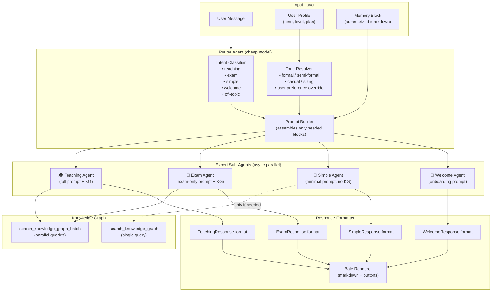

---

## 3. Split Prompt System

Instead of one huge concatenated prompt, each agent gets only the blocks it needs.

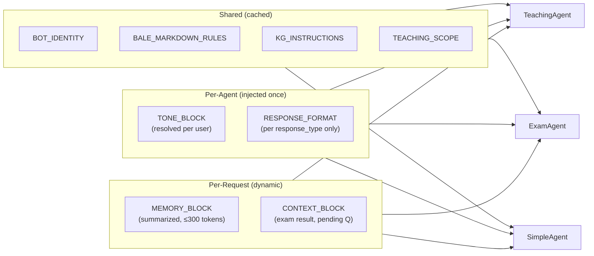

### Prompt Block Sizes (target)

| Block | Tokens (approx) | Cached? |
|-------|-----------------|---------|
| `BOT_IDENTITY` | ~40 | ✅ yes |
| `BALE_MARKDOWN_RULES` | ~50 | ✅ yes |
| `TEACHING_SCOPE` | ~20 | ✅ yes |
| `KG_INSTRUCTIONS` | ~50 | ✅ yes |
| `TONE_BLOCK` (one variant) | ~80 | ✅ per tone variant |
| `RESPONSE_FORMAT` (per type) | ~60 | ✅ per type |
| `MEMORY_BLOCK` | ~200 | ❌ dynamic |
| `CONTEXT_BLOCK` | ~50 | ❌ dynamic |

**Current:** all blocks concatenated every call → ~500 tokens always in context  
**New:** shared blocks cached via LLM prefix cache; only dynamic blocks paid per call

---

## 4. Tone of Voice System

Users can choose or the system auto-detects their tone on first message.

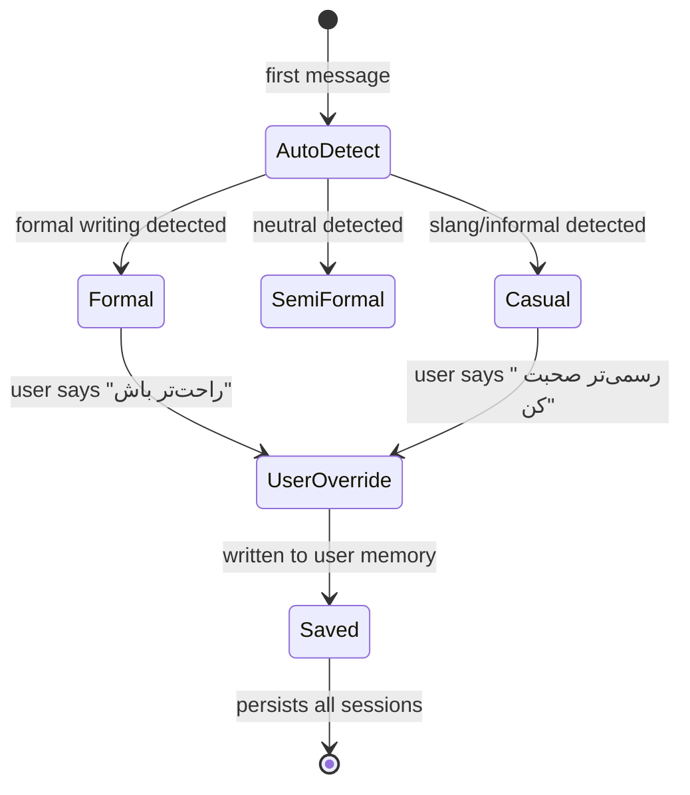

### Tone Blocks

```python
TONE_BLOCKS = {
    "formal":       "رسمی، محترمانه، فاصله‌دار — مثل استاد دانشگاه",
    "semi_formal":  "دوستانه + حرفه‌ای — لحن ترکیبی",
    "casual":       "گرم، اسلنگ‌اوکی، مثل دوست صمیمی",
    "enthusiastic": "پرانرژی، تشویقی، واکنش‌پذیر",
}
```

Stored in user profile — not re-detected every call after first session.

---

## 5. Expert Async Sub-Agents

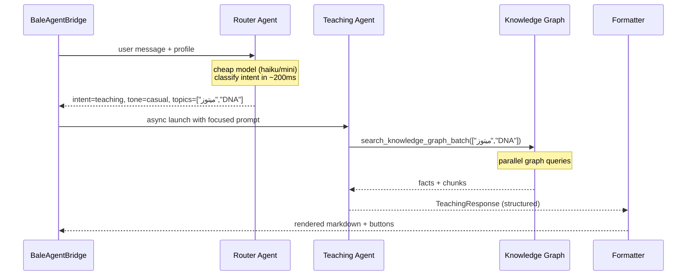

### Sub-Agent Configuration

| Agent | Model | `max_tool_calls` | KG Access | System Prompt Blocks |
|-------|-------|-------------------|-----------|----------------------|
| Router | haiku / gpt-4o-mini | 0 | ❌ | identity + classify rules |
| Teaching | full model | 3 | ✅ batch | identity + tone + teaching format + KG + scope |
| Exam | full model | 2 | ✅ batch | identity + tone + exam format + KG + scope |
| Simple | haiku / gpt-4o-mini | 0–1 | conditional | identity + tone + simple format |
| Welcome | full model | 0 | ❌ | identity + tone + welcome format |

---

## 6. Per-Feature Response Formats

Split `AgentResponse` into focused Pydantic models — no null-heavy single model.

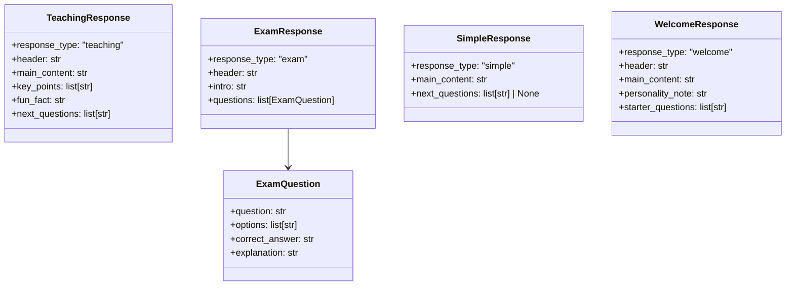

Each agent's `response_format=` only includes fields it actually uses → fewer output tokens, no null fields, better structured output accuracy.

---

## 7. Cost Reduction Strategy

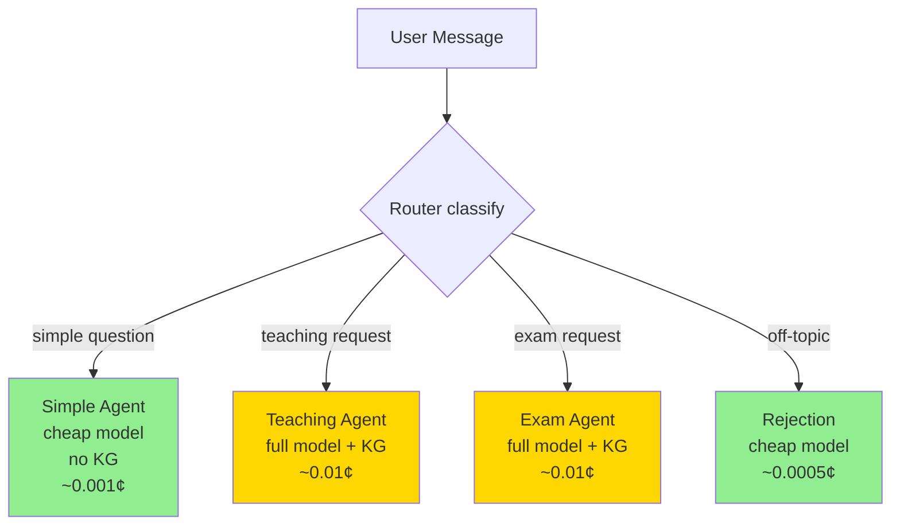

### Token Budget per Call

| Scenario | Current | New | Saving |
|----------|---------|-----|--------|
| Simple chat ("ممنون") | ~500 sys + ~200 out | ~150 sys + ~100 out | **~60%** |
| Teaching request | ~500 sys + ~400 out | ~350 sys (cached) + ~350 out | **~20%** |
| Exam (10 questions) | ~500 sys + ~800 out | ~300 sys (cached) + ~700 out | **~25%** |
| Off-topic rejection | ~500 sys + ~100 out | ~150 sys + ~80 out | **~70%** |

---

## 8. Faster Response Strategy

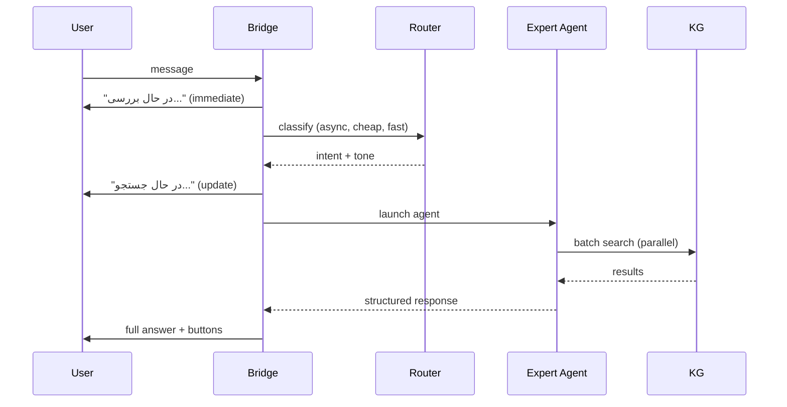

**Optimizations:**
1. Router is cheap/fast → intent known in ~200ms
2. KG batch search runs parallel sub-queries
3. `on_thinking` callback fires immediately on first LLM token (already exists)
4. Simple responses skip KG entirely → no wait
5. Prompt cache hit on shared blocks → reduced TTFT

---

## 9. Memory Architecture

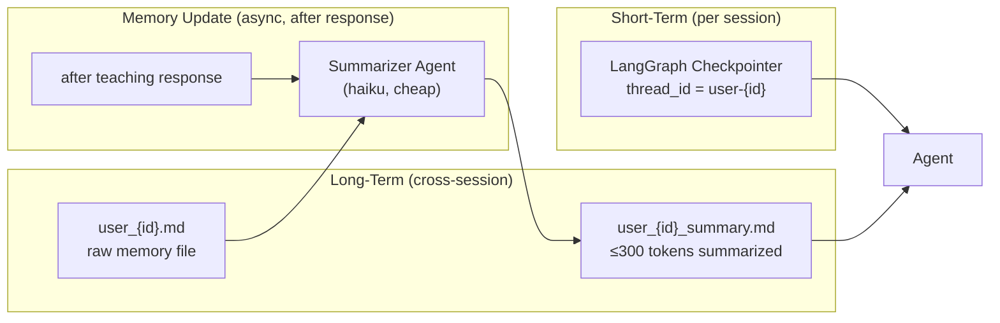

Instead of prepending the full raw memory file, prepend only the summarized version (≤300 tokens). Summarization runs async after response delivery — never blocks the user.

---

## 10. New Directory Structure

```
backend/src/app/agent/
├── router/
│   ├── intent_classifier.py      # cheap model, returns intent + tone
│   └── prompt_builder.py         # assembles blocks per intent
├── experts/
│   ├── teaching_agent.py         # teaching specialist
│   ├── exam_agent.py             # exam specialist
│   ├── simple_agent.py           # simple/quick replies
│   └── welcome_agent.py          # onboarding
├── prompts/
│   ├── shared.py                 # BOT_IDENTITY, BALE_MARKDOWN, KG, SCOPE
│   ├── tones.py                  # TONE_BLOCKS dict (4 variants)
│   └── formats.py                # per-type format instructions
├── response_models/
│   ├── teaching.py               # TeachingResponse
│   ├── exam.py                   # ExamResponse + ExamQuestion
│   ├── simple.py                 # SimpleResponse
│   └── welcome.py                # WelcomeResponse
├── memory/
│   ├── loader.py                 # load + summarize memory
│   └── writer.py                 # async memory update
├── graphiti_tool.py              # unchanged
└── langfuse.py                   # unchanged
```

---

## 11. Bridge Changes (`agent_bridge.py`)

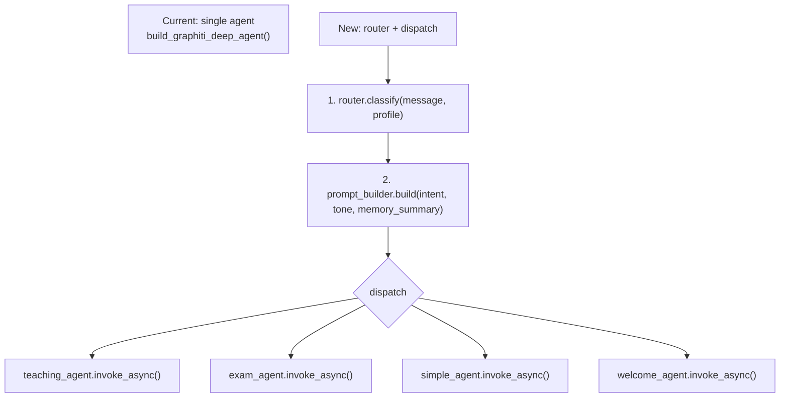

```python
# New bridge invoke flow (sketch)
async def invoke_reply(self, user_id, message, callbacks):
    profile = await get_user_profile(user_id)
    memory = await load_memory_summary(user_id)          # ≤300 tokens
    intent = await self.router.classify(message, profile) # cheap model
    prompt = self.prompt_builder.build(intent, memory)
    agent = self.agents[intent.type]                      # pre-built, cached
    response = await agent.ainvoke(prompt, callbacks=callbacks)
    asyncio.create_task(update_memory(user_id, response)) # async, non-blocking
    return response
```

---

## 12. Tone Selection — User Flow

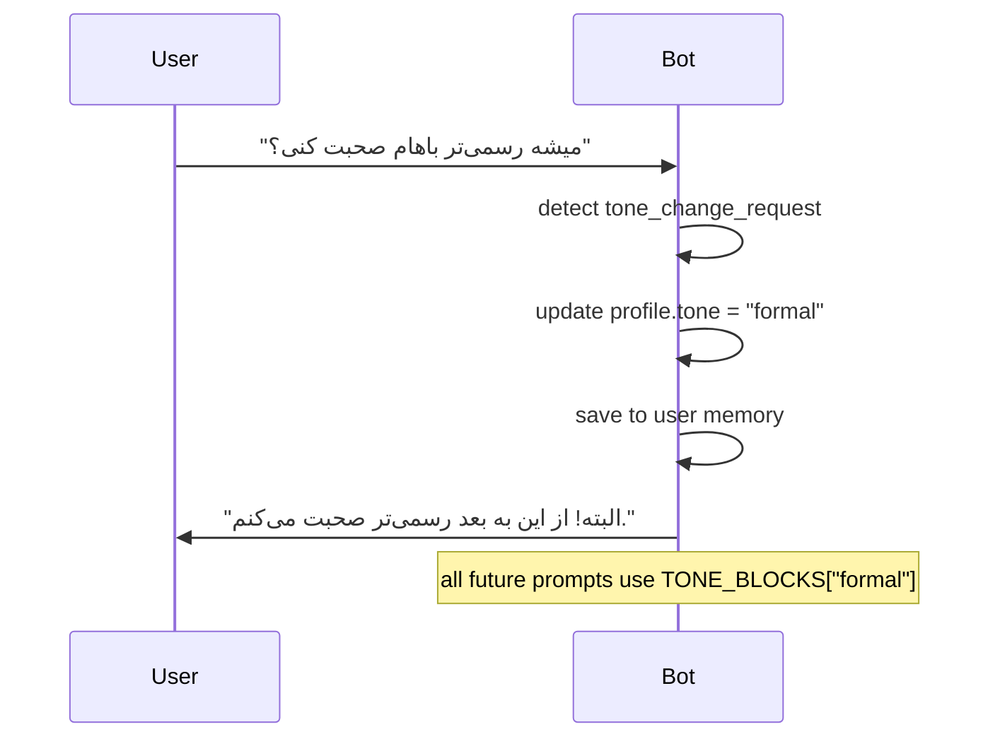

**Tone trigger phrases:**
- `"رسمی‌تر باش"` / `"رسمی صحبت کن"` → `formal`
- `"راحت‌تر باش"` / `"دوستانه‌تر"` → `casual`
- `"انرژیک‌تر"` / `"با انگیزه‌تر"` → `enthusiastic`

---

## 13. Implementation Priority

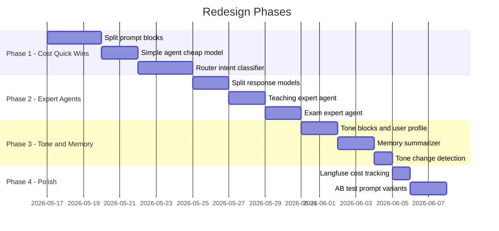

---

## 14. Key DeepAgents Advanced Features to Use

| Feature | Where to Apply |
|---------|----------------|
| **Prompt prefix caching** | All shared prompt blocks in expert agents |
| **`response_format=` per agent** | One focused Pydantic model per expert (no null fields) |
| **`ToolCallLimitMiddleware`** per agent | Teaching=3, Exam=2, Simple=1, Router=0 |
| **`FilesystemBackend`** | Memory summary files with `virtual_mode=True` |
| **Async `ainvoke`** | Router → dispatch → expert all async |
| **`astream_events` v2** | Keep existing streaming for UI callbacks |
| **`HarnessProfile` exclusions** | Keep current safe tool exclusions |
| **Separate checkpointer per agent type** | `thread_id` per agent type to avoid state bleed |

---

## 15. Summary — Current vs New

| Dimension | Current | New |
|-----------|---------|-----|
| Prompt system | 1 monolithic prompt | 6 composable blocks, only needed blocks sent |
| Agent count | 1 agent for all types | 1 router + 4 expert agents |
| Model routing | always full model | cheap model for router + simple; full for teaching/exam |
| Tone | fixed `TONE_AND_STYLE` block | 4 tone variants, user-selectable, persisted |
| Response model | 1 `AgentResponse` with many null fields | 4 focused models, zero null fields |
| KG calls per run | max 1 (middleware) | max 3 (teaching), 1 batch = many parallel queries |
| Memory | full raw file prepended | summarized ≤300 token block, async update |
| Cost (simple msg) | pays full model + full prompt | cheap model + minimal prompt (~60% cheaper) |
| Speed (simple msg) | full agent pipeline | router + simple agent, no KG (~50% faster) |

---

## 16. Skills — Useful in This Design

**Yes — Skills are a strong fit.** Instead of packing everything into one giant system prompt, each capability becomes a `SKILL.md` file. The agent reads only the frontmatter at startup (progressive disclosure), and only loads the full skill when the intent matches — saving tokens on every unrelated request.

### Skills to Create

| Skill | Trigger | What it adds |
|-------|---------|--------------|
| `biology-teaching` | user asks for a lesson | teaching format rules, KG search instructions, key_points structure |
| `exam-generator` | user asks for a test/quiz | exam format rules, ExamQuestion schema, difficulty guidance |
| `tone-manager` | user asks to change tone | tone variant descriptions, how to detect and apply each tone |
| `memory-recall` | user references past sessions | how to read and use summarized memory block |
| `onboarding` | `/start`, first message | welcome format, personality detection from profile photo |

```
backend/src/app/agent/
└── skills/
    ├── biology-teaching/
    │   └── SKILL.md
    ├── exam-generator/
    │   └── SKILL.md
    ├── tone-manager/
    │   └── SKILL.md
    ├── memory-recall/
    │   └── SKILL.md
    └── onboarding/
        └── SKILL.md
```

```python
# Pass skills dir to each expert agent
agent = create_deep_agent(
    model=resolved_model,
    tools=tools,
    system_prompt=BASE_SYSTEM_PROMPT,   # identity + markdown rules only (~90 tokens)
    skills=["src/app/agent/skills"],    # rest loaded on demand
    response_format=TeachingResponse,
)
```

**Token saving:** base system prompt drops from ~500 tokens to ~90 tokens. Skills load only when matched — teaching skill tokens only paid on teaching requests, never on simple replies.

---

## 17. Human-in-the-Loop — Clarifying Unclear Questions

**Yes — HIL is the right pattern when the router can't confidently classify intent.**

### When to Interrupt

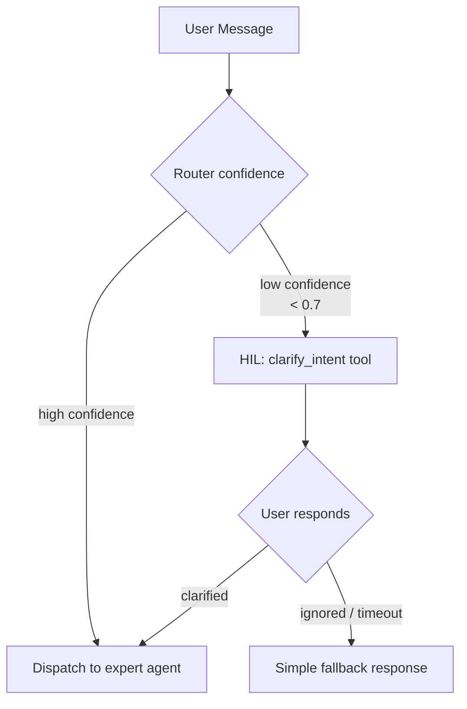

### Implementation

```python
from deepagents import create_deep_agent
from langchain.tools import tool

@tool
def clarify_intent(question: str) -> str:
    """Ask the user a clarifying question when their request is ambiguous."""
    return question   # actual response comes from human interrupt

router_agent = create_deep_agent(
    model=cheap_model,
    tools=[clarify_intent],
    interrupt_on={
        "clarify_intent": {"allowed_decisions": ["respond"]},
        # "respond" = human types the answer directly as the tool result
    },
    checkpointer=checkpointer,   # required for HIL
    system_prompt=ROUTER_PROMPT,
)
```

### Scenarios Where HIL Helps

| Ambiguous Input | HIL Question | Result |
|----------------|-------------|--------|
| "تست بده" (could mean exam OR system test) | "آزمون زیست می‌خوای یا چیز دیگه؟" | routes correctly |
| "توضیح بده" (no topic given) | "کدوم مبحث زیست یازدهم؟" | teaching agent gets focused query |
| "یه چیز جالب بگو" (teaching? simple?) | no HIL — router picks `simple` at threshold 0.5 | avoids unnecessary interruption |

### HIL vs Auto-Clarify Threshold

```python
CLARIFY_THRESHOLD = 0.65   # router confidence below this → ask user
AUTO_SIMPLE_THRESHOLD = 0.5  # very low → just respond simply, don't interrupt
```

- **Above 0.65:** dispatch directly
- **0.5–0.65:** interrupt with one short clarifying question
- **Below 0.5:** treat as `simple`, respond without KG, no interruption

### Updated Architecture with Skills + HIL

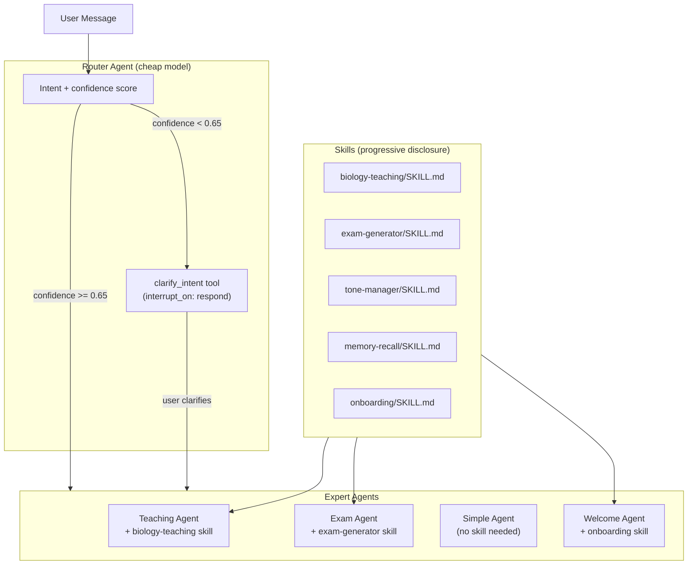
